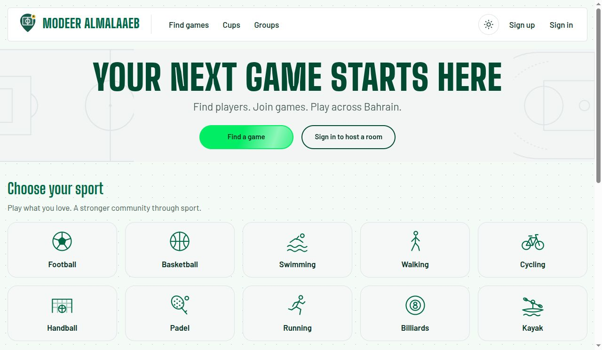

# Modeer Almalaaeb

A community sports platform for Bahrain: find an activity, host a room, meet players, and stay connected through groups and live chat. We built it to make arranging real-world games and outings easier.

This repository contains the **React frontend** of the deployed, English-language website. Responsive layouts support desktop and mobile browsers.



## Getting started

- [Open the deployed app](https://modeer-almalaaeb-frontend.vercel.app).
- [Backend repository](https://github.com/hassanelmaayati/modeer-almalaaeb-backend) · [API documentation](https://modeer-almalaaeb-backend.onrender.com/docs).
- Planning: [original specification](https://docs.google.com/document/d/146Ux37oZdEJnZHlKk3vzWZATzfPnYqUf0dR-ri5tRlU/edit?usp=sharing), [original wireframes](https://excalidraw.com/#json=mm8VWN_xrBNjyhHDay83Q,RyXy2F4vY2rYgb8-3t7_Xw), and [planning materials below](#planning-materials).

Visitors can browse games and cups. Sign up or sign in to view and manage groups, host or join rooms, create cups, send messages, and manage your profile. Google sign-in appears when matching Google client IDs are configured in both applications.

## Features

- **Discovery:** filter activities by sport, difficulty, governorate, date, or optional nearby search.
- **Rooms:** create and edit scheduled games, choose open admission or host approval, manage places and readiness, share a venue pin, and coordinate in live room chat.
- **Community:** create and edit groups, invite registered players, manage friendships and blocks, and use group or direct messages.
- **Messaging:** edit or delete your own messages, track unread counts, and receive realtime updates.
- **Cups:** organize knockout tournaments or races, register teams and rosters, record results, and delete an unpublished draft cup.
- **Profiles and history:** edit your profile, review joined and hosted rooms, record attendance, and rate eligible players after an activity.
- **Notifications and appearance:** follow in-app notices and choose light or dark mode.

The current catalogue contains **football, basketball, padel, swimming, walking, running, cycling, handball, billiards, and kayak**. Outings support participant pools with optional distance, pace, and route notes. Times are displayed in Bahrain time.

## Technologies used

| Area | Technologies |
| --- | --- |
| Application | JavaScript/JSX, React, React Router, Vite |
| Interface | CSS Flexbox/Grid, responsive layouts, SVG artwork, Fontsource fonts |
| API and live updates | Fetch API, JWT bearer authentication, native browser WebSockets |
| Maps | Leaflet, React Leaflet, OpenStreetMap tiles |
| Optional authentication | Google Identity Services through `@react-oauth/google` |
| Testing and delivery | Vitest, React Testing Library, Playwright, ESLint, GitHub Actions, Vercel |
| Companion backend | Python, FastAPI, SQLAlchemy, Alembic, PostgreSQL/PostGIS |

The backend uses in-memory realtime hubs and an in-process room lifecycle worker. Browser requests go through the API; database credentials and the JWT signing secret belong on the backend.

## Team portfolio

All three team members contributed across the frontend and backend. These portfolios highlight representative frontend contributions; several features were developed collaboratively. See the [backend portfolio](https://github.com/hassanelmaayati/modeer-almalaaeb-backend#team-portfolio) for their server-side work.

| Contributor | Features contributed | Technologies used |
| --- | --- | --- |
| [Hassan El Maayati](https://github.com/hassanelmaayati) | Sign-in/sign-up and optional Google authentication; cup creation and details; player rating controls; editing and deleting own messages | React, React Router, JavaScript, Fetch API, Google OAuth, CSS, Vitest |
| [Ahmed Tarek](https://github.com/ctarek2015-wq) | Activity discovery and group pages; API/session integration; realtime room and notification updates; automated tests and deployment workflows | React, Fetch API, WebSockets, Vitest, React Testing Library, Playwright, Vite, GitHub Actions |
| [FatimaHubail](https://github.com/FatimaHubail) | Room creation, editing, and scheduling; venue maps; friends and messaging interfaces; responsive styling and accessible controls | React, React Router, Leaflet, React Leaflet, CSS Flexbox/Grid, Vitest |

## Attributions

- Fonts: [Barlow](https://fontsource.org/fonts/barlow), [Big Shoulders Display](https://fontsource.org/fonts/big-shoulders-display), and [Saira Stencil One](https://fontsource.org/fonts/saira-stencil-one), distributed through [Fontsource](https://fontsource.org). Each uses the [SIL Open Font License 1.1](https://openfontlicense.org).
- Map data and tiles: [OpenStreetMap contributors](https://www.openstreetmap.org/copyright). Map controls retain the on-map attribution; OpenStreetMap data is available under the Open Database License.
- Mapping libraries: [Leaflet](https://leafletjs.com) ([BSD-2-Clause license](https://github.com/Leaflet/Leaflet/blob/v1.9.4/LICENSE)) and [React Leaflet](https://react-leaflet.js.org) ([Hippocratic License](https://github.com/PaulLeCam/react-leaflet/blob/v5.0.0/LICENSE.md)).
- Application libraries: [React](https://react.dev) ([MIT license](https://github.com/facebook/react/blob/main/LICENSE)), [React Router](https://reactrouter.com) ([MIT license](https://github.com/remix-run/react-router/blob/main/LICENSE.md)), [Vite](https://vite.dev) ([MIT license](https://github.com/vitejs/vite/blob/main/LICENSE)), and [React OAuth Google](https://github.com/MomenSherif/react-oauth) ([MIT license](https://github.com/MomenSherif/react-oauth/blob/master/LICENSE)).

The README logo is the app's existing SVG logo. The homepage image is an actual capture of the deployed website in light mode; the older designs below are planning references.

## Future enhancements

- Add a sports news feature.
- Build a dedicated mobile app.

## Local development

Use **Node.js 24.x** and npm. Start the [backend locally](https://github.com/hassanelmaayati/modeer-almalaaeb-backend#local-development) on port 8000, then run from this repository:

```bash
npm ci
cp .env.example .env
npm run dev
```

Open the local URL printed by Vite. The example environment uses `VITE_API_BASE_URL=/api/v1` and `VITE_API_PROXY_TARGET=http://127.0.0.1:8000`; the Vite proxy handles HTTP and WebSockets. Change the proxy target if your backend uses another port. Allow the Vite origin in the backend's `CORS_ORIGINS` for socket connections.

`VITE_GOOGLE_CLIENT_ID` is optional and must match the backend's Google client ID. Only public settings belong in `VITE_` variables.

### Verification

```bash
npm run lint
npm test
npm run build
npm run test:e2e
```

The offline browser runner requires the sibling backend checkout, its Python 3.14 development environment, PostgreSQL/PostGIS binaries, and installed Playwright browsers. It builds the frontend, uses a disposable local database, and checks Chromium, Firefox, WebKit, and realtime proxy journeys. `npm run test:offline` also runs lint and unit coverage. See [the runner](scripts/offline-runner.mjs) and [test manifest](scripts/test-manifest.json) for prerequisite overrides and coverage.

## Deployment

Vercel hosts the frontend; HTTP and WebSockets use the same Render backend. `vercel.json` configures the Vite build, `dist` output, and SPA rewrites, so refreshing an internal route works.

Use Node.js 24.x and set the Vercel Production environment variable:

```text
VITE_API_BASE_URL=https://modeer-almalaaeb-backend.onrender.com/api/v1
```

Keep **Enable access to System Environment Variables** enabled so the build detects Vercel and rejects a missing or non-HTTPS production API URL. Changes to frontend environment values require a rebuild.

Set the backend's `CORS_ORIGINS` to `https://modeer-almalaaeb-frontend.vercel.app`, without a path or trailing slash. Preview domains need explicit origin permission. Leave Google configuration empty unless the same OAuth client is configured in both applications.

The [GitHub Actions workflow](.github/workflows/ci.yml) checks configuration, lint, unit coverage, and the build. Its deployment job runs for successful pushes to `main` when `VERCEL_DEPLOY_ENABLED` and the required Vercel credentials are configured. Use this gated workflow with native Vercel Git deployments disabled to avoid bypassing those checks. Verify the catalogue and refresh an internal route after a release.

## Current data and routes

The application has **nine database tables**: `users`, `sports`, `rooms`, `memberships`, `messages`, `groups`, `cups`, `notifications`, and `player_ratings`. Rooms, groups, messages, cups, and memberships relate to users. Membership targets determine the relationship type; the current model has no `kind` column. Room places and cup entries/fixtures are server-validated JSON.

API paths below use the `/api/v1` prefix. Room cancellation and membership actions preserve their history; **cups and messages provide create, read, update, and delete flows**.

| Feature | Frontend routes | API examples |
| --- | --- | --- |
| Accounts and profiles | `/sign-in`, `/sign-up`, `/users/:userId`, `/settings` | `POST /auth/signup`, `/auth/login`, `/auth/logout`; `GET/PUT /users/me` |
| Discovery and rooms | `/`, `/sports`, `/rooms/new`, `/rooms/:roomId`, `/rooms/:roomId/edit`, `/my-rooms`, `/joined-rooms` | `GET /sports`; `GET/POST /rooms`; `GET/PUT /rooms/{room_id}`; `POST /rooms/{room_id}/cancel` |
| Groups and friendships | `/groups` (create/edit/detail dialogs), `/friends` | `GET/POST /groups`; `GET/PUT /groups/{group_id}`; `GET/POST /friends` |
| Messages | `/messages`, `/messages/:type/:id`; room and group chat | `GET/POST /messages`; `PATCH/DELETE /messages/{message_id}` |
| Cups | `/cups`, `/cups/new`, `/cups/:cupId` | `GET/POST /cups`; `GET/PATCH/DELETE /cups/{cup_id}` |
| Notifications and ratings | `/notifications`, room details, profiles | `GET/PATCH /notifications`; `POST /rooms/{room_id}/ratings`; `GET /users/{user_id}/rating` |
| Realtime | Shared room, chat, and notification connections | `POST /socket-ticket`; `WS /ws?ticket=...`; public `WS /ws/lobby` |

## Planning materials

The shared specification and original designs explain the team's starting idea. These **historical planning diagrams and wireframes** predate some implemented models, fields, routes, and UI details; current source and API documentation describe the shipped behavior.

| Planning reference | Preview | Editable source |
| --- | --- | --- |
| Database design | [Original ERD](assets/previews/erd.png) | [ERD SVG](assets/diagrams/erd.svg) |
| HTTP and page map | [Original endpoint map](assets/previews/endpoints.png) | [Endpoint SVG](assets/diagrams/endpoints.svg) |
| React component design | [Original component hierarchy](assets/previews/component-hierarchy.png) | [Hierarchy SVG](assets/diagrams/component-hierarchy.svg) |

<details>
<summary>Original wireframe gallery</summary>

### Discover


### Create and join


### Walk, run, or cycle


### After the activity


</details>
