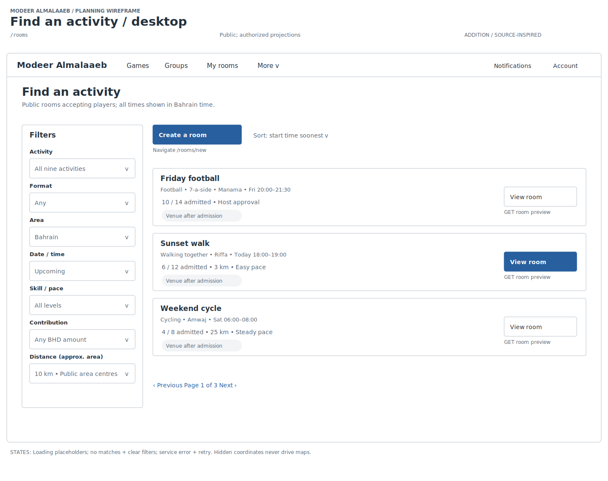
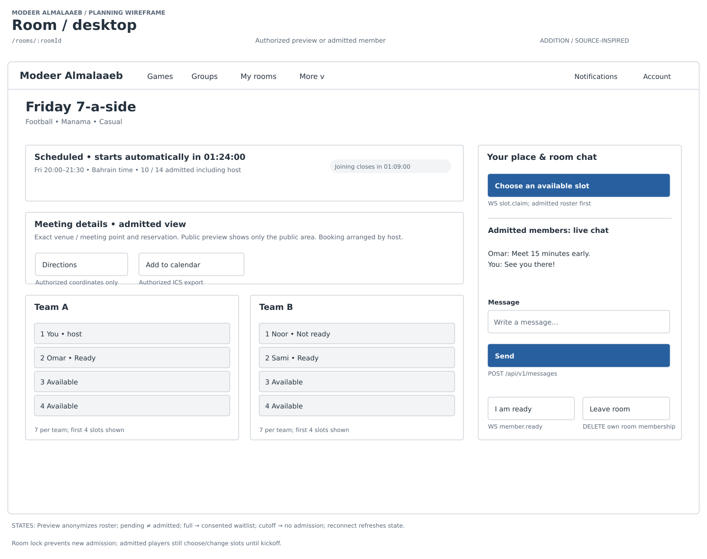
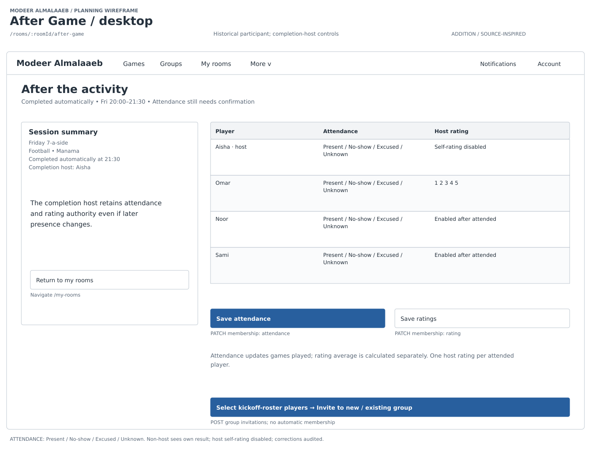
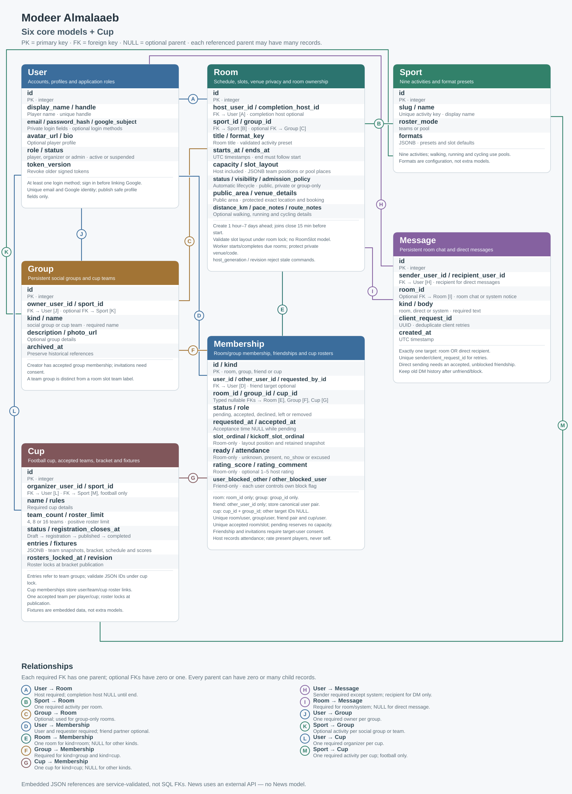
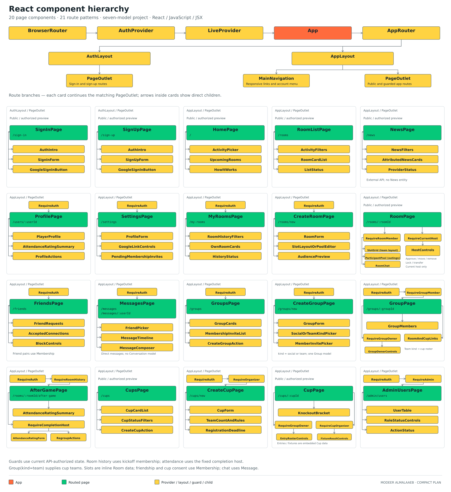

# Modeer Almalaaeb

Modeer El Malaaeb is a team-built community platform for people in Bahrain to discover and organize sports and outdoor activities, coordinate participants, and keep in touch through rooms, groups and messaging.

- [Live application](https://modeer-almalaaeb-frontend.vercel.app/)
- [API documentation](https://modeer-almalaaeb-backend.onrender.com/docs)
- [Backend repository](https://github.com/hassanelmaayati/modeer-almalaaeb-backend) · [Frontend repository](https://github.com/hassanelmaayati/modeer-almalaaeb-frontend)

## Team

Built collaboratively by [Ahmed Tarek](https://github.com/ctarek2015-wq), [Hassan Elmaayati](https://github.com/hassanelmaayati) and [Fatima Hubail](https://github.com/FatimaHubail). The Git history records each teammate's contributions across the application.

## Local development

Use Node.js 24.x and start the [backend](https://github.com/hassanelmaayati/modeer-almalaaeb-backend#local-database-setup) on port 8000 before opening the frontend.

```bash
npm ci
cp .env.example .env
npm run dev
```

The example environment sets `VITE_API_BASE_URL=/api/v1` and `VITE_API_PROXY_TARGET=http://127.0.0.1:8000`. Vite proxies HTTP and WebSocket traffic under `/api` to that backend. Set the backend's `CORS_ORIGINS` to the exact local Vite origin. Google sign-in is optional; leave `VITE_GOOGLE_CLIENT_ID` empty unless the backend uses the matching Google client ID.

## Frontend architecture

React and React Router render responsive pages and shared dialogs, with a persisted light/dark theme preference. Service modules in `src/services/` use the API client for REST requests; shared session helpers keep account boundaries consistent. The application starts a public lobby socket for discovery and one authenticated socket per signed-in account.

`websocketService` obtains a single-use ticket from `POST /api/v1/socket-ticket` before connecting to `/api/v1/ws?ticket=...`. It sends heartbeat pings, reconnects with backoff, and distributes room, message and notification events. The public `/api/v1/ws/lobby` channel supports district subscriptions. Writes remain REST requests; pages refetch data on reconnect and message history is recovered through the paged API.

The backend uses FastAPI, JWT authentication, SQLAlchemy/Alembic and PostgreSQL with PostGIS. Its socket hubs and lifecycle tasks run in one application process; the current deployment needs one backend instance with one worker and has no Redis service.

## Testing and CI

```bash
npm run lint
npm test
npm run test:unit:coverage
npm run build
```

Unit and component tests use Vitest and React Testing Library. Playwright suites also cover authentication journeys, rooms, groups, cups and realtime behavior. The full offline browser runner needs the backend checkout, Python 3.14 with its locked dependencies, PostgreSQL/PostGIS binaries, and installed Playwright browsers:

```bash
npx playwright install --with-deps chromium firefox webkit
MODEER_BACKEND_PATH=/absolute/path/to/backend npm run test:prerequisites
MODEER_BACKEND_PATH=/absolute/path/to/backend npm run test:offline
```

Set `MODEER_TEST_PYTHON` and `MODEER_TEST_PG_BIN` if those prerequisites are not discoverable. The offline runner uses an isolated test backend and database, not the deployed application.

[GitHub Actions](.github/workflows/ci.yml) requires the gate-policy check, ESLint, unit coverage and production build to pass through the `Frontend CI` gate. The current workflow does not run the full Playwright suite as a mandatory CI job. When `VERCEL_DEPLOY_ENABLED` is `true`, only a successful, current `main` commit is released by the gated deployment job.

## Vercel deployment

Import this repository in Hassan's Vercel account and select the Hobby plan. Use
the `main` production branch and Node.js 24.x; `vercel.json` sets the Vite build,
`dist` output and SPA rewrites so refreshing `/groups`, `/sports` and other routes
works.

Keep **Enable access to System Environment Variables** enabled in Vercel so the
build can detect Vercel and reject a missing or non-HTTPS production API URL.

Set `VITE_API_BASE_URL` in Vercel's **Production** environment to
`https://YOUR-BACKEND.onrender.com/api/v1` before deploying. This public URL also
sets the secure WebSocket destination; no separate WebSocket service is needed.
Vite's `/api` proxy is for local development only. Never add database credentials
or the backend JWT secret to frontend environment variables.

After Vercel assigns the production URL, set that exact origin (without a trailing
slash) as `CORS_ORIGINS` in Render and redeploy the backend. Preview deployments
need their own explicitly allowed origins to call it. Leave `VITE_GOOGLE_CLIENT_ID`
unset unless Google sign-in is configured with the same client ID on the backend.
Changing a `VITE_` variable requires a new frontend build/deployment.

Production releases use the gated GitHub Actions deployment described above. Verify `/sports` loads backend sports and refresh `/groups` directly after the deployment. `vercel.json` also contains a Content Security Policy tied to the deployed backend; review its HTTP and WebSocket origins when changing the backend hostname.

## Project idea

A community website for people in Bahrain to organize activities, make friends, build groups and chat.

Activities (seeded catalogue): football, basketball, padel, swimming, **walking together, running and cycling**, handball, billiards and kayak. Outings use participant lists with optional distance, pace and route notes.

**Scope:** Nine backend tables: users, sports, rooms, memberships, messages, groups, cups, notifications and player ratings.

**Status:** Implemented and deployed; English-first desktop/mobile website. **Stack:** React/Vite (JavaScript/JSX), FastAPI, SQLAlchemy/Alembic, PostgreSQL with PostGIS, and WebSockets.

Original project idea:

https://docs.google.com/document/d/146Ux37oZdEJnZHlKk3vzWZATzfPnYqUf0dR-ri5tRlU/edit?usp=sharing

## Repository links

- [Backend](https://github.com/hassanelmaayati/modeer-almalaaeb-backend)
- [Frontend](https://github.com/hassanelmaayati/modeer-almalaaeb-frontend)

## User stories

- As a visitor, I want to browse activities and rooms so I can find a suitable game or outing.
- As a player, I want an account and profile so others can recognize me.
- As a host, I want to schedule rooms and approve players so I can organize my activity.
- As an admitted player, I want a slot, readiness and room chat so we can coordinate.
- As a completion host, I want to record attendance and rate attended players so history reflects participation.
- As a player, I want accepted friendships and direct messages so I can coordinate privately.
- As a group owner/member, I want invitations and reusable groups so we can meet again.
- As a captain/organizer, I want cups with accepted rosters, knockout brackets or races so teams can compete.
- As a player, I want notifications and completed-room ratings so I can follow participation and feedback.

## Wireframes


Main planning screens, organized by journey. The preview images show the original design direction; the deployed interface has continued to evolve.

### Discover

**Home**


**Browse and filter rooms**



### Create and join

**Create and open a scheduled activity**


**Admitted player: choose a slot and coordinate**



### Walk, run or cycle

**Admitted player: mobile roster and meeting details**


### After the activity

**Completion host: attendance, ratings and group invitations**



Original wireframes; the new designs add mobile layouts and missing screens:

https://excalidraw.com/#json=mm8VWN_xrBNjyhHDay83Q,RyXy2F4vY2rYgb8-3t7_Xw

## ERDs

| Model | Stores |
| --- | --- |
| User | Accounts, profiles, home district and optional Google link (no roles); names are unique ignoring case |
| Sport | Activities and format presets; each sport's cup format comes from the server |
| Room | Schedule, privacy, admission policy, capacity, slot layout, venue point (PostGIS), cancellation and host hand-over state |
| Membership | Room/group members, friend connections and cup rosters |
| Message | Room chat, group chat, direct messages and system notices; senders can edit or soft-delete their own |
| Group | Social groups and persistent teams |
| Cup | Entries, knockout bracket or race results |
| Notification | Per-user notices and read state; read ones expire after 30 days and all after 90 |
| Player rating | A final 1–5 star rating from one player to another for one completed room |

Membership has no `kind` column: the row type follows from which target is set
(`room_id`, `group_id`, `cup_id` with `group_id`, or `other_user_id` for friends).
Friend rows carry one block flag per side (`user_blocked_other`, `other_blocked_user`). Room memberships record when a player was admitted (`accepted_at`). Room slots (`{"slots": [...]}` or `{"teams": [...]}`) and cup
entries/fixtures are JSON validated by the server.



[Editable ERD](assets/diagrams/erd.svg) (the diagram predates notifications, player ratings, the room venue, cancellation and host fields, message edit/delete times and `memberships.accepted_at`)

## Routes/endpoints

The [backend README](https://github.com/hassanelmaayati/modeer-almalaaeb-backend#routesendpoints) documents current API methods under `/api/v1`. FastAPI also exposes interactive [API documentation](https://modeer-almalaaeb-backend.onrender.com/docs).

| Area | Current frontend routes / interaction | API capability |
| --- | --- | --- |
| Account | `/sign-in`, `/sign-up`, `/users/:userId`, `/settings` | JWT signup/login/logout, optional Google sign-in/link, profiles and rating summaries |
| Discovery | `/`, `/sports` | Sports catalogue and paged rooms; public lobby updates |
| Rooms | `/rooms/new`, `/rooms/:roomId`, `/rooms/:roomId/edit`, `/my-rooms`, `/joined-rooms` | Room creation/editing, admission, slots, readiness, cancellation, host transfer and completed-room attendance/ratings |
| Groups and friends | `/groups` with shared dialogs, `/friends` | Groups/teams, membership invitations, friendships and blocking |
| Messages | `/messages`, `/messages/:type/:id` | Room/group/direct history, conversation lists, message edit and soft-delete |
| Cups | `/cups`, `/cups/new`, `/cups/:cupId` | Entries and rosters, knockout brackets and race results with revision checks |
| Notifications | Header bell and `/notifications` | Per-user notices and read state with realtime refresh |

Rooms open on creation and start/finish through the backend lifecycle tasks. The API enforces consent, admission, privacy and action-specific permissions; the interface displays errors for stale revisions and invalid changes. API timestamps are UTC and the frontend presents Bahrain time.

The [route map](assets/diagrams/endpoints.svg) is a planning asset and may predate current routes or permissions.

## Component hierarchy

Shared account/session helpers and the WebSocket service support room pages, friends, groups, messaging, cups and notifications. This planning diagram is an overview; `src/App.jsx` and `src/services/` describe the current implementation.



[Editable hierarchy](assets/diagrams/component-hierarchy.svg)

## Current limits

External sports news and administrative user roles are not implemented. The application is English-first; Arabic, browser push, calendar export, waiting lists and automatic slot assignment remain future work. Socket events are not a durable event log, so reconnecting clients refetch REST data. The ERD, route map and other planning assets are retained for project context and may show earlier designs; current backend models and API documentation take precedence.
